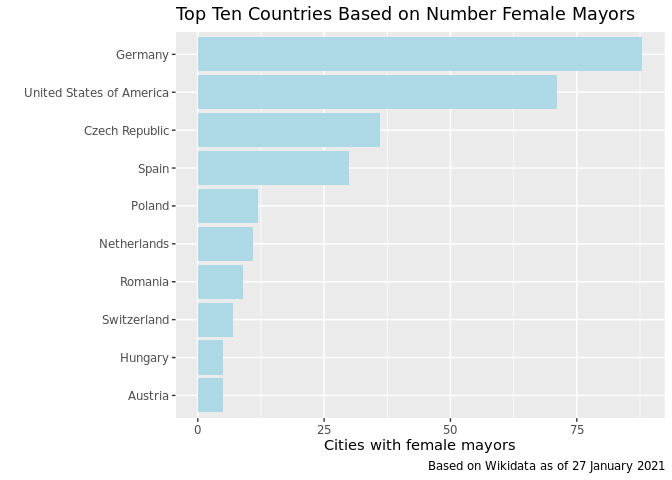
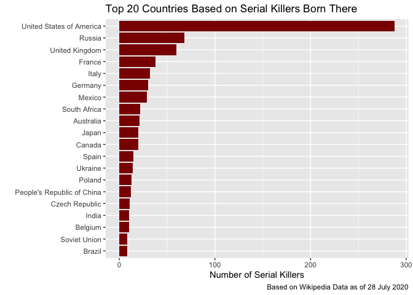

<!-- README.md is generated from README.Rmd. Please edit that file -->

# wikifacts 

<!-- badges: start -->

[](https://www.tidyverse.org/lifecycle/#experimental)
[](https://CRAN.R-project.org/package=wikifacts)
[](https://cran.r-project.org/package=wikifacts)
[](https://github.com/keithmcnulty/wikifacts/actions)
[](https://travis-ci.com/keithmcnulty/wikifacts)
[](https://codecov.io/gh/keithmcnulty/wikifacts?branch=master)
<!-- badges: end -->

An R package which gets facts and data from Wikipedia and Wikidata.

## Installation

You can install the released version of wikifacts from
[CRAN](https://CRAN.R-project.org) with:

``` r
install.packages("wikifacts")
```

And the development version from [GitHub](https://github.com/) with:

``` r
# install.packages("devtools")
devtools::install_github("keithmcnulty/wikifacts")
```

## Functionality

  - `wiki_query()` sends SPARQL queries to Wikidata and retrieves
    results in a dataframe.
  - `wiki_didyouknow()` generates random ‘did you know’ facts from
    Wikipedia main page
  - `wiki_inthenews()` generates srandom ‘in the news’ facts from
    Wikipedia main page
  - `wiki_onthisday()` generates random ‘on this day’ facts from
    Wikipedia main page
  - `wiki_randomfact()` generates random facts from Wikipedia main page
  - `wiki_search()` launches browser with Wikipedia search results

## Examples - Query Wikidata

You can send SPARQL queries to Wikidata using `wiki_query()` and
retrieve the results in a dataframe. If you have never queried Wikidata
before, [here](https://query.wikidata.org/) is a good starting point to
construct SPARQL queries and you can find lots of examples
[here](https://www.wikidata.org/wiki/Wikidata:SPARQL_query_service/queries/examples).

In this example, a bar chart is created to show the top ten countries
according to the number of cities with female mayors, according to data
in Wikidata:

``` r
library(wikifacts)
library(ggplot2)

mayor_query <- 'SELECT ?countryLabel (count(*) AS ?count)
WHERE
{
    ?city wdt:P31/wdt:P279* wd:Q515 . # find instances of subclasses of city
    ?city p:P6 ?statement .           # with a P6 (head of goverment) statement
    ?statement ps:P6 ?mayor .         # ... that has the value ?mayor
    ?mayor wdt:P21 wd:Q6581072 .      # ... where the ?mayor has P21 (sex or gender) female
    FILTER NOT EXISTS { ?statement pq:P582 ?x }  # ... but the statement has no P582 (end date) qualifier
    ?city wdt:P17 ?country .          # Also find the country of the city
    
    # If available, get the "ru" label of the country, use "en" as fallback:
    SERVICE wikibase:label {
        bd:serviceParam wikibase:language "en" .
    }
}
GROUP BY ?countryLabel
ORDER BY DESC(?count)
LIMIT 10'

mayors <- wiki_query(mayor_query)

ggplot(mayors, aes(x = count, y = reorder(countryLabel, count))) +
  geom_bar(stat = "identity", fill = "lightblue") +
  labs(x = "Cities with female mayors",
       y = "",
       title = "Top Ten Countries Based on Number Female Mayors",
       caption = paste("Based on Wikidata as of", format(Sys.Date(), "%d %B %Y")))
```



Or, a more darker topic, the top twenty countries by number of serial
killers born there:

``` r
serial_killers <- 'SELECT ?countryLabel (COUNT(?human) AS ?count) WHERE { # TEST
  SERVICE wikibase:label { bd:serviceParam wikibase:language "[AUTO_LANGUAGE],en". }
  ?human wdt:P106 wd:Q484188. 
  ?human wdt:P19 ?place_of_birth.
  ?place_of_birth wdt:P17 ?country .
}
GROUP BY ?countryLabel
ORDER BY DESC(?count)
LIMIT 20'


serialkillers <- wiki_query(serial_killers)

ggplot(serialkillers, aes(x = count, y = reorder(countryLabel, count))) +
  geom_bar(stat = "identity", fill = "darkred") +
  labs(x = "Number of Serial Killers",
       y = "",
       title = "Top 20 Countries Based on Serial Killers Born There",
       caption = paste("Based on Wikidata as of", format(Sys.Date(), "%d %B %Y")))
```



## Examples - Retrieving facts from Wikipedia Main Pages

``` r
cat(wiki_didyouknow())
#> Did you know that Michael Boddenberg (pictured), the minister of finance of the German state of Hesse, once directed a school for butchers and bakers? (Courtesy of Wikipedia)
```

``` r
cat(wiki_randomfact())
#> Did you know that on November 24 in 1542 – Anglo-Scottish Wars: England captured about 1,200 Scottish prisoners with its victory in the Battle of Solway Moss. (Courtesy of Wikipedia)
```

Use with `cowsay`:

``` r
cowsay::say(wiki_randomfact())
#> 
#>  -------------- 
#> Here's some news from 11 February 2016. A 6.4-magnitude earthquake strikes Taiwan, killing more than fifty people. (Courtesy of Wikipedia) 
#>  --------------
#>     \
#>       \
#>         \
#>             |\___/|
#>           ==) ^Y^ (==
#>             \  ^  /
#>              )=*=(
#>             /     \
#>             |     |
#>            /| | | |\
#>            \| | |_|/\
#>       jgs  //_// ___/
#>                \_)
#> 
```

Generate multiple random facts:

``` r
wiki_randomfact(n_facts = 10, bare_fact = TRUE)
#>  [1] "1845 – German composer Felix Mendelssohn's Violin Concerto, one of the most popular violin concertos of all time, received its world première in Leipzig."                                      
#>  [2] "2013 – A group of militants stormed a high-altitude mountaineering base camp in Gilgit–Baltistan, Pakistan, and killed 11 people; 10 climbers and one local guide."                             
#>  [3] "... that Mount Harriet National Park in the Andaman Islands is a butterfly hotspot?"                                                                                                            
#>  [4] "... that Lady Canning, India's first vicereine, has been described as one of the country's most memorable women botanical illustrators?"                                                        
#>  [5] "1430 – Philip the Good established the Order of the Golden Fleece, referred to as the most prestigious, exclusive, and expensive order of chivalry in the world."                               
#>  [6] "... that the human-like behaviour of Jenny (depicted), a resident of London Zoo, reinforced Charles Darwin's view that humans were \"created from animals\"?"                                   
#>  [7] "In China, a new strain of coronavirus (examples pictured) infects more than a thousand people, killing at least forty-one."                                                                     
#>  [8] "At the Grammy Awards in Los Angeles, Billie Eilish (pictured) wins the major categories of Best New Artist, and Song, Record, and Album of the Year."                                           
#>  [9] "Vladimir Putin (pictured) is re-elected President of Russia."                                                                                                                                   
#> [10] "2011 – Global demonstrations against economic inequality (protests in Madrid pictured), corporate influence on government, and other issues, were held in more than 950 cities in 82 countries."
```

Search Wikipedia (launches browser with results):

``` r
wiki_search('R (programming language)')
```
