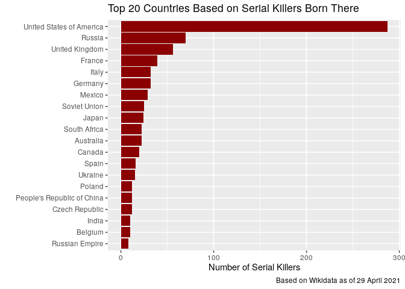

<!-- README.md is generated from README.Rmd. Please edit that file -->

# wikifacts 

<!-- badges: start -->

[](https://www.tidyverse.org/lifecycle/#experimental)
[](https://CRAN.R-project.org/package=wikifacts)
[](https://cran.r-project.org/package=wikifacts)
[](https://github.com/keithmcnulty/wikifacts/actions)
[](https://travis-ci.com/keithmcnulty/wikifacts)
[](https://codecov.io/gh/keithmcnulty/wikifacts?branch=master)
<!-- badges: end -->

An R package which gets facts and data from Wikipedia and Wikidata.

## Installation

You can install the released version of wikifacts from
[CRAN](https://CRAN.R-project.org) with:

``` r
install.packages("wikifacts")
```

And the development version from [GitHub](https://github.com/) with:

``` r
# install.packages("devtools")
devtools::install_github("keithmcnulty/wikifacts")
```

## Functionality

-   `wiki_query()` sends SPARQL queries to Wikidata and retrieves
    results in a dataframe.
-   `wiki_define()` generates a short definition of the given terms as
    an extract from Wikipedia article.
-   `wiki_didyouknow()` generates random ‘did you know’ facts from
    Wikipedia main page.
-   `wiki_inthenews()` generates random ‘in the news’ facts from
    Wikipedia main page.
-   `wiki_onthisday()` generates random ‘on this day’ facts from
    Wikipedia main page.
-   `wiki_randomfact()` generates random facts from Wikipedia main page.
-   `wiki_define()` obtains definitions of terms from Wikipedia.
-   `wiki_search()` launches browser with Wikipedia search results.

## Examples - Query Wikidata

You can send SPARQL queries to Wikidata using `wiki_query()` and
retrieve the results in a dataframe. If you have never queried Wikidata
before, [here](https://query.wikidata.org/) is a good starting point to
construct SPARQL queries and you can find lots of examples
[here](https://www.wikidata.org/wiki/Wikidata:SPARQL_query_service/queries/examples).

In this example, a bar chart is created to show the top ten countries
according to the number of cities with female mayors, according to data
in Wikidata:

``` r
library(wikifacts)
library(ggplot2)

mayor_query <- 'SELECT ?countryLabel (count(*) AS ?count)
WHERE
{
    ?city wdt:P31/wdt:P279* wd:Q515 . # find instances of subclasses of city
    ?city p:P6 ?statement .           # with a P6 (head of goverment) statement
    ?statement ps:P6 ?mayor .         # ... that has the value ?mayor
    ?mayor wdt:P21 wd:Q6581072 .      # ... where the ?mayor has P21 (sex or gender) female
    FILTER NOT EXISTS { ?statement pq:P582 ?x }  # ... but the statement has no P582 (end date) qualifier
    ?city wdt:P17 ?country .          # Also find the country of the city
    
    # If available, get the "ru" label of the country, use "en" as fallback:
    SERVICE wikibase:label {
        bd:serviceParam wikibase:language "en" .
    }
}
GROUP BY ?countryLabel
ORDER BY DESC(?count)
LIMIT 10'

mayors <- wiki_query(mayor_query)

ggplot(mayors, aes(x = count, y = reorder(countryLabel, count))) +
  geom_bar(stat = "identity", fill = "lightblue") +
  labs(x = "Cities with female mayors",
       y = "",
       title = "Top Ten Countries Based on Number Female Mayors",
       caption = paste("Based on Wikidata as of", format(Sys.Date(), "%d %B %Y")))
```


Or, a more dark topic, the top twenty countries by number of serial
killers born there:

``` r
serial_killers <- 'SELECT ?countryLabel (COUNT(?human) AS ?count) WHERE { 
  SERVICE wikibase:label { bd:serviceParam wikibase:language "[AUTO_LANGUAGE],en". }
  ?human wdt:P106 wd:Q484188. # occupation: serial killer
  ?human wdt:P19 ?place_of_birth. # get place of birth
  ?place_of_birth wdt:P17 ?country . # map to country
}
GROUP BY ?countryLabel
ORDER BY DESC(?count)
LIMIT 20'


serialkillers <- wiki_query(serial_killers)

ggplot(serialkillers, aes(x = count, y = reorder(countryLabel, count))) +
  geom_bar(stat = "identity", fill = "darkred") +
  labs(x = "Number of Serial Killers",
       y = "",
       title = "Top 20 Countries Based on Serial Killers Born There",
       caption = paste("Based on Wikidata as of", format(Sys.Date(), "%d %B %Y")))
```



## Examples - Getting definitions of terms from Wikipedia

``` r
# Create animals dataframe
animals <- data.frame(
  name = c("kangaroo", "kookaburra", "wombat", "tasmanian devil", "quokka")
)

# get definitions from wikipedia
knitr::kable(
  animals %>% 
    dplyr::mutate(definition = wiki_define(name, sentence = 1))
)
```

| name            | definition                                                                                                                                                                                                            |
|:----------------|:----------------------------------------------------------------------------------------------------------------------------------------------------------------------------------------------------------------------|
| kangaroo        | The kangaroo is a marsupial from the family Macropodidae (macropods, meaning “large foot”).                                                                                                                           |
| kookaburra      | Kookaburras are terrestrial tree kingfishers of the genus Dacelo native to Australia and New Guinea, which grow to between 28 and 42 centimetres (11 and 17 inches) in length and weigh around 300 grams (11 ounces). |
| wombat          | Wombats are short-legged, muscular quadrupedal marsupials that are native to Australia.                                                                                                                               |
| tasmanian devil | The Tasmanian devil (Sarcophilus harrisii) is a carnivorous marsupial of the family Dasyuridae.                                                                                                                       |
| quokka          | The quokka, also known as the short-tailed scrub wallaby () (Setonix brachyurus), the only member of the genus Setonix, is a small macropod about the size of a domestic cat.                                         |

## Examples - Retrieving facts from Wikipedia Main Pages

``` r
cat(wiki_didyouknow())
#> Did you know that Elsa Cavelti, who appeared in dramatic roles at the Opernhaus Zürich and taught voice at the Musikhochschule Frankfurt, was Wagner's Brangäne at La Scala? (Courtesy of Wikipedia)
```

``` r
cat(wiki_randomfact())
#> Did you know that on April 26 in 1970 – The World Intellectual Property Organization came into being when its convention entered into force. (Courtesy of Wikipedia)
```

Use with `cowsay`:

``` r
cowsay::say(wiki_randomfact())
#> 
#>  -------------- 
#> Here's some news from 22 July 2015. The United States and Cuba restore full diplomatic relations after 54 years. (Courtesy of Wikipedia) 
#>  --------------
#>     \
#>       \
#>         \
#>             |\___/|
#>           ==) ^Y^ (==
#>             \  ^  /
#>              )=*=(
#>             /     \
#>             |     |
#>            /| | | |\
#>            \| | |_|/\
#>       jgs  //_// ___/
#>                \_)
#> 
```

Generate multiple random facts:

``` r
wiki_randomfact(n_facts = 10, bare_fact = TRUE)
#>  [1] "2492 BC – According to legend, Armenian culture hero Hayk slew the giant king Bel with a shot from a longbow near Lake Van (in modern Turkey)."                 
#>  [2] "1816 – Sir John Barrow, secretary at the Admiralty, rejected a proposal to use Francis Ronalds's electrical telegraph, deeming it \"wholly unnecessary\"."      
#>  [3] "1900 – FC Bayern Munich, Germany's most successful football club, was founded."                                                                                 
#>  [4] "1882 – The Knights of Columbus, the world's largest Catholic fraternal service organization, was founded by Michael J. McGivney in New Haven, Connecticut, U.S."
#>  [5] "... that the Memorial of the War to Resist US Aggression and Aid Korea has collected the names of 183,108 Chinese soldiers killed in the Korean War?"           
#>  [6] "1945 – A parade to celebrate the end of World War II turned into a riot, followed by widespread disturbances and killings in and around Sétif, French Algeria." 
#>  [7] "Magnus Carlsen  defeats Fabiano Caruana to retain the World Chess Championship."                                                                                
#>  [8] "... that The Hammer of Thor by Rick Riordan won a Stonewall Book Award for its portrayal of the genderfluid character Alex Fierro?"                             
#>  [9] "An overloaded tourist ferry capsizes in Lake Toba (pictured), Indonesia, killing at least 3 people and leaving 193 others missing."                             
#> [10] "1138 – Lý Anh Tông was enthroned as emperor of Đại Việt at the age of two, starting a 37-year reign."
```

Search Wikipedia (launches browser with results):

``` r
wiki_search('R (programming language)')
```
